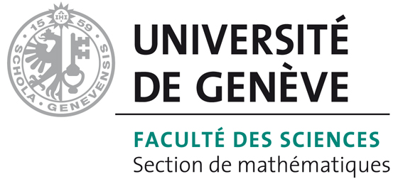

## Code repository for the Generating Function Method

This repository contains a python code library and scripts implemented during the development of the Generating Function Method (GFM),
which intend to describe and analyze the main current iterative PinT algorithms within a common framework (Parareal, MGRIT, PFASST, STMG, ...).

It currently depends on classical python package like [Numpy](https://numpy.org/) and [Matplotlib](https://matplotlib.org/),
plus an external package for the generation of quadrature nodes for collocation methods, [Pythag](https://gitlab.com/tlunet/pythag).
More informations on how Pythag can be installed and used [here](./doku/pythag.md).

If you have any issue with running the code, 
don't hesitate to open an [issue](https://github.com/Parallel-in-Time/gfm/issues) with the Github interface. 

### Repository structure

#### [doku](./doku) 

Markdown documentation pages.

#### [gfm](./gfm)

Python library for the gfm package.

#### [notes](./notes)

Jupyter notebooks with small numerical investigations on PinT methods using the gfm library.

#### [outputs](./outputs)

Scripts to reproduce the figures of a manuscript on the GFM method (in preparation)

#### [tutorials](./tutorials)

Jupyter notebooks with example and tutorials on how to use the gfm library.

### Collaborations and fundings

This repository results from a collaboration between Jülich Supercomputing Centre 
(<a href="https://www.fz-juelich.de/SharedDocs/Personen/IAS/JSC/EN/staff/speck_r.html">Robert SPECK</a>), 
Hamburg University of Technology 
(<a href="https://www.mat.tuhh.de/home/druprecht/?homepage_id=druprecht">Daniel RUPRECHT</a>,
 <a href="https://www.mat.tuhh.de/home/tlunet/?homepage_id=tlunet">Thibaut LUNET</a>) 
and the University of Geneva 
(<a href="https://www.unige.ch/~gander/">Martin J. GANDER</a>), as part of the 
<a href="https://www.timex-eurohpc.eu/">Time-X project</a>. 

   &nbsp;&nbsp;&nbsp;&nbsp;&nbsp;&nbsp;&nbsp;&nbsp;
   &nbsp;&nbsp;&nbsp;&nbsp;
   &nbsp;&nbsp;&nbsp;&nbsp;
  

This project has received funding from the European High-Performance Computing Joint Undertaking (JU) under grant agreement No 955701.
The JU receives support from the European Union’s Horizon 2020 research and innovation programme and Belgium, France, Germany, and Switzerland.
This project also received funding from the German Federal Ministry of Education and Research (BMBF) grant 16HPC048.

   &nbsp;&nbsp;&nbsp;&nbsp;&nbsp;&nbsp;&nbsp;&nbsp;
   &nbsp;&nbsp;&nbsp;&nbsp;&nbsp;&nbsp;&nbsp;&nbsp;
  

